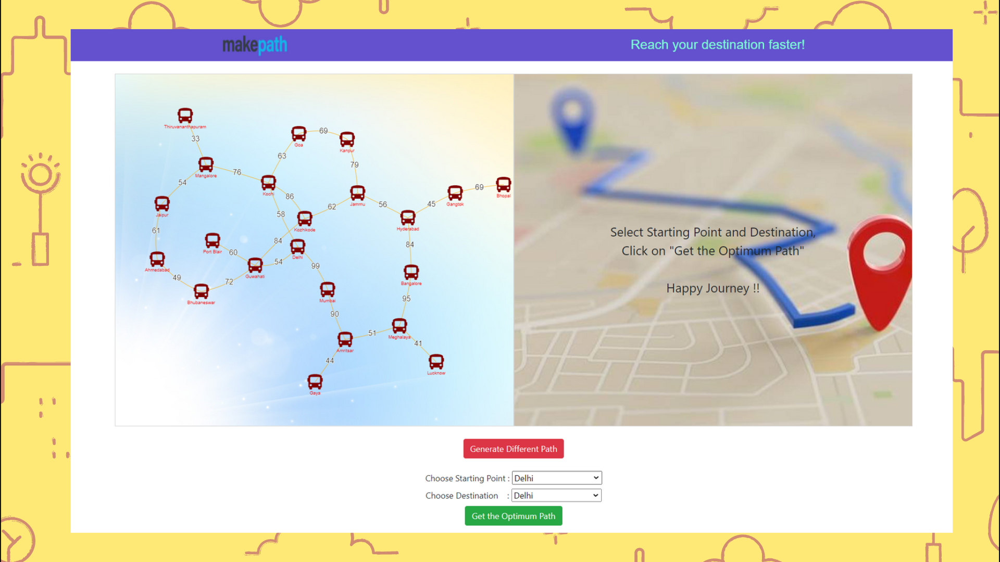
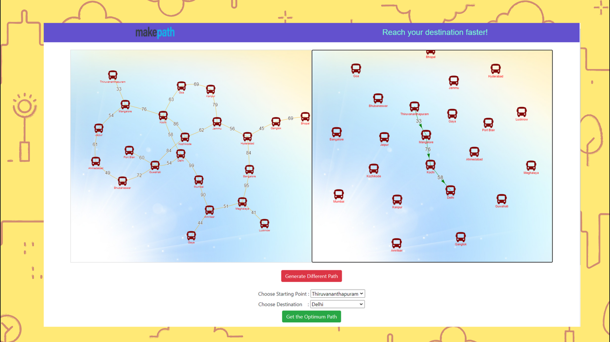

# MAKEPATH 
#### (Reach your destination Faster!)
This is ADS mini-project based on Graph Data Structure, implementation of Dijkstra's Algorithm. 
It uses vis.js to show the output graph that gives you the fastest path possible.

## Graph Data Structure
A Graph is a non-linear data structure consisting of nodes and edges. 

The nodes are sometimes also referred to as vertices and the edges are lines or arcs that connect any two nodes in the graph. 

A Graph consists of a finite set of vertices(or nodes) and a set of Edges that connect a pair of nodes.

## Algorithm
1) Create a set sptSet (shortest path tree set) that keeps track of vertices included in the shortest path tree. Initially, this set is empty.

2) Assign a distance value to all vertices in the input graph. Initialize all distance values as INFINITE. Assign distance value as 0 for the source vertex so that it is picked first.

3) While sptSet doesn’t include all vertices Pick a vertex *u* which is not there in sptSet and has a minimum distance value. Include *u* to sptSet. Update distance value of all adjacent vertices of *u*.

## Screenshots
These are the screenshots of some important pages

### Home Page:

### Result: Minimum time

### Result: Fastest Path

 

#### This project was done by: 
Adwait Hegde, Yash Jagtap, Naitik Jain
